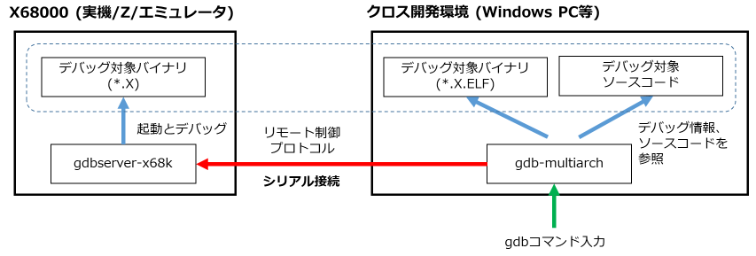
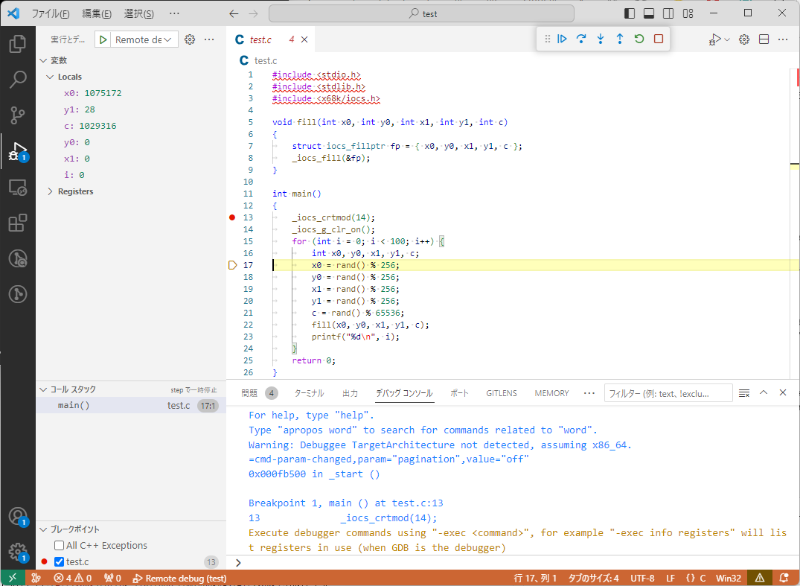

# gdbserver-x68k

## 概要

[elf2x68k](https://github.com/yunkya2/elf2x68k) で開発した X680x0 のプログラムを、シリアルポートで接続したクロス開発環境から GNU デバッガ (gdb) でデバッグするリモートデバッガです。
gdbserver (https://github.com/bet4it/gdbserver) を元にしています。

elf2x68k でプログラムをビルドすると、

  * m68k クロスツールチェインが出力する ELF ファイル
  * ELF ファイルから変換される、X68k上で実行できる X 形式ファイル

の2種類のファイルが生成されます。
X68k上ではデバッグ対象の X 形式実行ファイルを `gdbserver` の上から実行し、シリアルで接続した先のクロス開発環境上では `gdb` (`gdb-multiarch`) が ELF ファイルのデバッグ情報とソースコードを参照してデバッグを行います。



## 使用方法

### X68k 上での事前準備

X68k 上では、`gdbserver.x` とデバッグ対象となる X 形式ファイルを用意しておきます。
エミュレータのホストファイルアクセス機能や [x68kserremote](https://github.com/yunkya2/x68kserremote)、 [x68kzremotedrv](https://github.com/yunkya2/x68kzremotedrv) などのような、クロス開発環境とファイルシステムを共有できる環境を用意しておくと便利です。

### クロス開発環境上での事前準備

クロス開発環境上ではデバッグ対象のソースコードとELFファイル、m68k コードがデバッグできる `gdb` (`gdb-multiarch`)、それに X68k 側とのシリアル接続が必要となります。
* デバッグ対象を X68k 実機や X68000 Z で動かす場合、RS-232C 端子や UART 端子とクロス開発環境側とをシリアル - USB 変換アダプタなどを用いて接続します
* デバッグ対象を X68k エミュレータで動かす場合はヌルモデムエミュレータ [com0com](https://ja.osdn.net/projects/sfnet_com0com/) で接続します。仮想 COM ポートの組を作って、片方の COM ポートをエミュレータの設定で X68k の RS-232C ポートに割り当て、もう片方の COM ポートを `gdb` のリモート接続先に指定します

#### MinGW の場合

* `gdb` (`gdb-multiarch`) は以下のようにインストールします
  ```
  pacman -S  mingw-w64-x86_64-gdb-multiarch
  ```
* `gdb` のリモート接続先には Windows 環境の COM ポート名 ("`com3`" など) をそのまま指定します

#### Linux (Ubuntu) の場合

* `gdb` (`gdb-multiarch`) は以下のようにインストールします
  ```
  sudo apt install gdb-multiarch
  ```
* `gdb` のリモート接続先には Linux のtty デバイス名 ("`/dev/ttyS2`" など) を指定します
* Linux 環境が Windows の WSL2 の場合、USB デバイスを WSL2 から利用できるようにするためには以下の接続手順を実施します
  * USB デバイスを接続する (https://learn.microsoft.com/ja-jp/windows/wsl/connect-usb)
  * 接続先のシリアルポートは USB 接続である必要があります。com0com で提供される仮想 COM ポートは現在のところ WSL2 から利用する手段がないため、WSL2 上の Linux からは X68k エミュレータに接続することはできません

### デバッグの開始

1. まず X68k 上で、デバッグ対象となるプログラムを `gdbserver.x` から以下のようにして起動します。
  `gdbserver` はデバッグ対象プログラムをロード後、シリアルポートからのコマンド待ちに入ります。
     * 何かキー入力を行うと、シリアルポート待ちを中止して `gdbserver` を終了します
    ```
    X> gdbserver <デバッグ対象プログラム> [<デバッグ対象プログラムの引数>...]
    Target addr:0xXXXX usp:0xXXXX ssp:0xXXXX
    Target <デバッグ対象> waiting for connection...
    ```
2. 次に、クロス開発環境上で ELFファイルを指定して `gdb-multiarch` を起動します
    ```
    $ gdb-multiarch <デバッグ対象ELF>
    GNU gdb (GDB) 13.2
    Copyright (C) 2023 Free Software Foundation, Inc.
    License GPLv3+: GNU GPL version 3 or later <http://gnu.org/licenses/gpl.html>
    This is free software: you are free to change and redistribute it.
    There is NO WARRANTY, to the extent permitted by law.
    Type "show copying" and "show warranty" for details.
    This GDB was configured as "x86_64-w64-mingw32".
    Type "show configuration" for configuration details.
    For bug reporting instructions, please see:
    <https://www.gnu.org/software/gdb/bugs/>.
    Find the GDB manual and other documentation resources online at:
        <http://www.gnu.org/software/gdb/documentation/>.
  
    For help, type "help".
    Type "apropos word" to search for commands related to "word"...
    Reading symbols from <デバッグ対象ELF>...
    (gdb) 
    ```
3. `gdb-multiarch` のプロンプトから `set serial baud` コマンドでシリアルポートの通信速度を、`target remote` コマンドでリモート接続先として X68k が繋がっているシリアルポート名を指定します。\
  正常に `gdbserver` と接続できると以下のように表示され、X68k 側では `Connected` と表示されます。
    ```
    (gdb) set serial baud <シリアルポート通信速度>
    (gdb) target remote <リモート接続先>
    Remote debugging using <リモート接続先>
    0xXXXXXXXX in _start ()
    (gdb)
    ```
    `gdb-multiarch` を起動する際に以下のようにオプション指定することで、`target remote`コマンドの実行までを一緒に行わせることもできます。
    ```
    gdb-multiarch -b <シリアルポート通信速度> -ex 'target remote <シリアルポート名>' <デバッグ対象ELF>
    ```
4. `gdbserver` との接続が確立した時点では、X68k 側はデバッグ対象プログラムの実行開始アドレスで止まっています。C 言語の `main()` 関数の先頭まで実行を進めるために、main にブレークポイントを仕掛けて以下のように実行を開始します。
    ```
    (gdb) b main
    Breakpoint 1 at 0xXXXX: file XXXX.c, line XXX.
    (gdb) c
    Continuing.
    
    Breakpoint 1, main (argc=X, argv=0xXXXX) at XXXX.c:XX
    (gdb)
    ```
5. 以降は、通常の `gdb` と同様にソースコードを参照してブレークポイントを仕掛けたり、変数を参照したりしてのデバッグが可能です。`q` コマンドで `gdb-multiarch` を終了すると、X68k 側の `gdbserver` も実行を終了します。

### Visual Studio Code を用いたデバッグ

Visual Studio Code (以下 VSCode) のデバッグ設定ファイル launch.json を適切に設定することで、クロス開発環境上の VSCode から X68k 側をデバッグすることも可能です。VSCode からデバッグ対象プログラムのソースコードのあるディレクトリを開いて、`.vscode/launch.json` を以下のように設定します (MinGW の場合)。
```
{
    // IntelliSense を使用して利用可能な属性を学べます。
    // 既存の属性の説明をホバーして表示します。
    // 詳細情報は次を確認してください: https://go.microsoft.com/fwlink/?linkid=830387
    "version": "0.2.0",
    "configurations": [

        {
            "name": "Remote debug",
            "type": "cppdbg",
            "request": "launch",
            "program": "${workspaceFolder}\\<デバッグ対象ELF>",
            "stopAtEntry": false,
            "cwd": "${workspaceFolder}",
            "environment": [],
            "externalConsole": false,
            "MIMode": "gdb",
            "miDebuggerPath": "C:\\msys64\\mingw64\\bin\\gdb-multiarch.exe",
            "miDebuggerServerAddress": "<リモート接続先>",
            "miDebuggerArgs": "-b 9600",
            "setupCommands": [
                {
                    "description": "gdb の再フォーマットを有効にする",
                    "text": "-enable-pretty-printing",
                    "ignoreFailures": true
                },
            ]
        }
    ]
}
```

X68k 上で `gdbserver.x` を起動後、VSCodeのソースコード上でブレークポイントを設定して `実行 - デバッグの開始` (F5キー) でデバッグを開始できます。 VSCode の画面上でステップ実行したり変数を参照したりできます。



## コマンドラインオプション

`gdbserver.x` には以下のコマンドラインオプションがあります

```
gdbserver.x [-s<通信速度>][-i<割り込みモード>] <デバッグ対象プログラム> [<デバッグ対象プログラムの引数>...]
```

* `-s<通信速度>`
  * シリアルポートの通信速度を指定します。省略した場合は `38400` となります
  * `gdb-multiarch` 側で設定する通信速度と同じ値を指定してください
* `-i<割り込みモード>`
  * `gdbserver.x` 実行中の割り込み許可モードを `0`～`2` の値で設定します
  * `DB.X` など既存の X68k のデバッガでは、デバッグ対象プログラムの実行がブレークポイントなどで停止されて制御がデバッガ本体に戻ってくる際に、元のプログラムの状態に関わらず常に割り込みが許可状態に戻されます。
  このため、例えば VSYNC 割り込みのように周期実行される割り込みハンドラにブレークポイントを仕掛けると、ブレークしてデバッガにも戻ってきている間も割り込みハンドラが呼ばれ続ける、といった現象が起きていました。
  * デバッガ自体も X68k 上で動作するプログラムの一つであり、デバッガ自身の動作にも割り込み処理が必要なためこれはやむを得ない仕様なのですが、`gdbserver.x` はデバッガの動作に必要なハードウェアがシリアル通信 (SCC) のみであることを利用して、割り込み禁止の間はシリアル受信をポーリングで行うことで、割り込み禁止状態のままでデバッガ機能を動作できるようになっています
  * `-i0` (デフォルト)
    * 他のデバッガと同様に、デバッグ対象プログラムから `gdbserver.x` に戻って来る際に元のプログラムの状態に関わらず割り込みを許可状態に戻します
  * `-i1`
    * デバッグ対象プログラムから `gdbserver.x` に戻って来る際、デバッグ対象の割り込み許可・禁止状態を引き継ぎます
    * 割り込みハンドラや割り込み禁止区間の中にブレークポイントを仕掛けた場合でも、同じ割り込みが掛かり続けることなくデバッグできます
  * `-i2`
    * `gdbserver.x` を常に割り込み禁止状態で実行します。デバッグ対象プログラムに処理が移って、そのプログラムが割り込み許可状態している間のみ割り込みが掛かります
    * デバッガ動作中、長時間に渡って割り込み禁止状態が続くという X68k システムが本来想定していない状態になるため、動作に不具合を起こすデバイスがあるかも知れません

## デバッグ対象プログラムの停止機能

* `gdb-multiarch` から一度デバッグ対象プログラムの実行開始を指示すると、ステップ実行やブレークポイントで停止するまではプログラムの実行が続きます
* インタラプトスイッチによって NMI 割り込みを発生させることで、この状態から実行を停止して処理をデバッガに戻すことができますが、`gdbserver.x` では `gdb-multiarch` 上で CTRL+C を入力することでも実行を停止できます
* この機能は、デバッグ対象プログラムに処理を移す際に一時的に SCC 受信割り込みを乗っ取って、プログラム実行中にシリアルポートからの CTRL+C 入力を割り込みでチェックすることで実現しています

## ビルド方法

ビルドには [elf2x68k](https://github.com/yunkya2/elf2x68k) が必要です。
ツールチェインにパスが通って m68k-xelf-gcc 等が実行できる状態で、以下の手順でビルドします。

```
$ make
```

ビルドに成功すると実行ファイル `gdbserver.x` が出来るので、X680x0 の環境上にコピーしてください。


## ライセンス

オリジナル (https://github.com/bet4it/gdbserver) と同じく GPL-3.0 ライセンスが適用されます。
